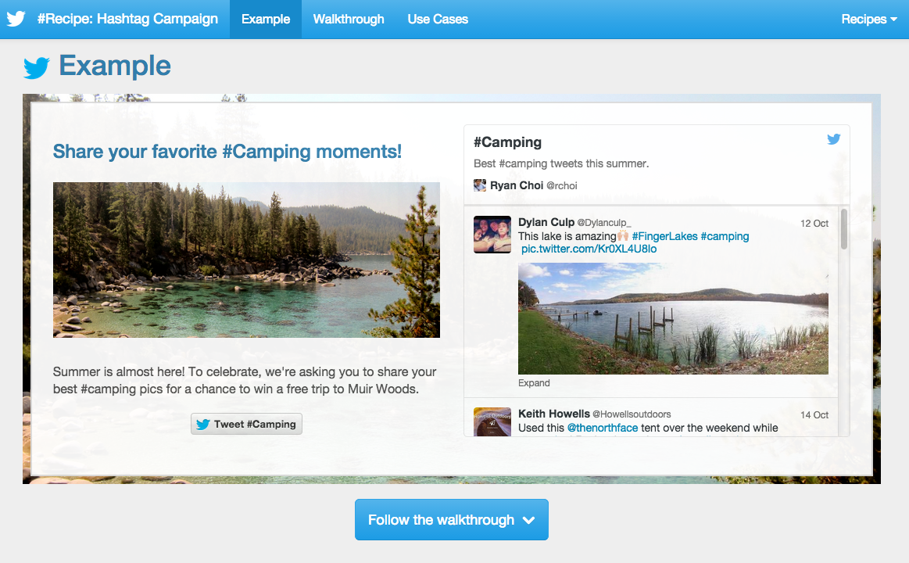
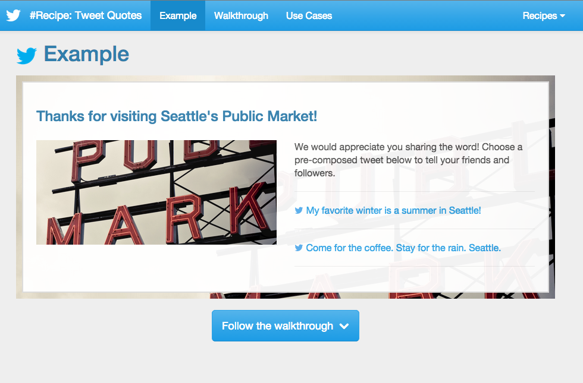

Web Recipes using Twitter For Web
====================

This bundle shows how to create common patterns using Twitter For Web widgets and components.
Included are:

- #Hashtag Campaigns
- Tweet Quotes

#Hashtag Campaigns
---------

Tweet Quotes
---------

Notes
---------

Much thanks to Start Bootstrap (http://startbootstrap.com/template-overviews/scrolling-nav/)
for the how-to and code samples on Scrolling Nav websites. 

License
---------

This code sample is available under MIT License.